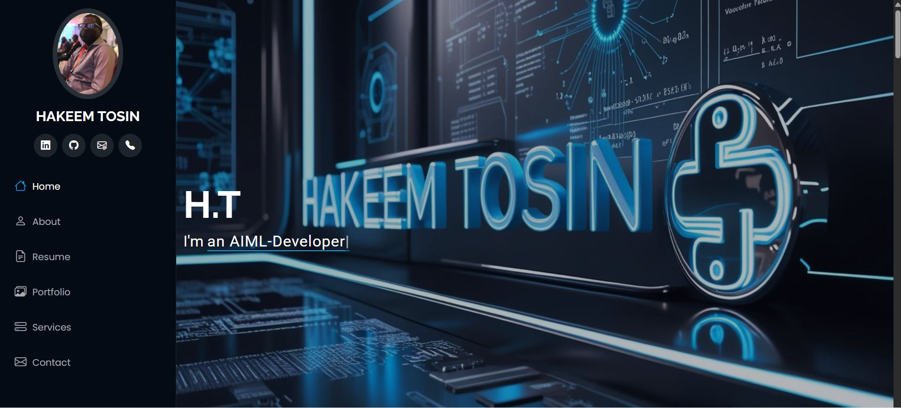
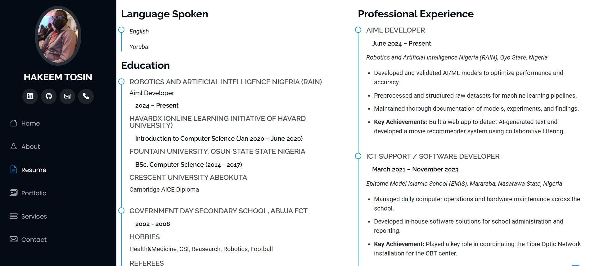
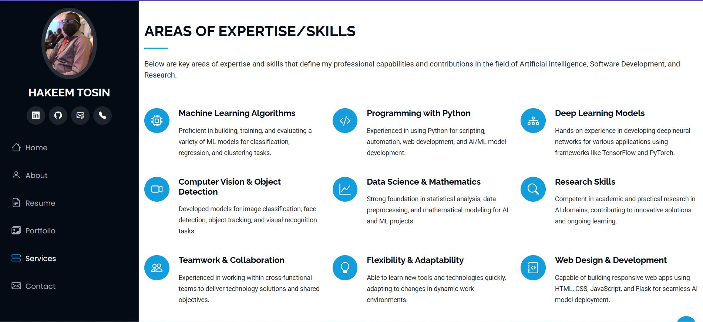

# Hakeem_portfolio
Personal Portfolio Website showcasing my professional profile, technical skills, AI/ML projects, and web development expertise. Built with HTML, CSS, JavaScript, and Flask.

# Hakeem Tosin – Personal Portfolio Website

This is the source code for my personal portfolio website, designed to showcase my skills, experience, and projects in Web Development, Artificial Intelligence, and Machine Learning.

---

## 📸 Demo Screenshots

  
  

## 🔗 Live Demo

[https://portfolio-link.com](https://your-portfolio-link.com)  
_(will be Replaced with actual link once deployed)_

---

## 📌 Features

- Responsive and modern UI
- AI/ML, Data Science, and Web Development skill highlights
- Dynamic resume and project sections
- Contact form with map and contact links
- Social links (LinkedIn, GitHub, Email, Phone)
- Built with HTML5, CSS3, JavaScript, and Flask (Python)

---

## 🧰 Tech Stack

- **Frontend:** HTML, CSS, JavaScript, Bootstrap, AOS, Typed.js  
- **Backend:** Python (Flask)  
- **Assets:** Bootstrap Icons, Google Fonts  
- **Tools:** VS Code, Git, GitHub

---

